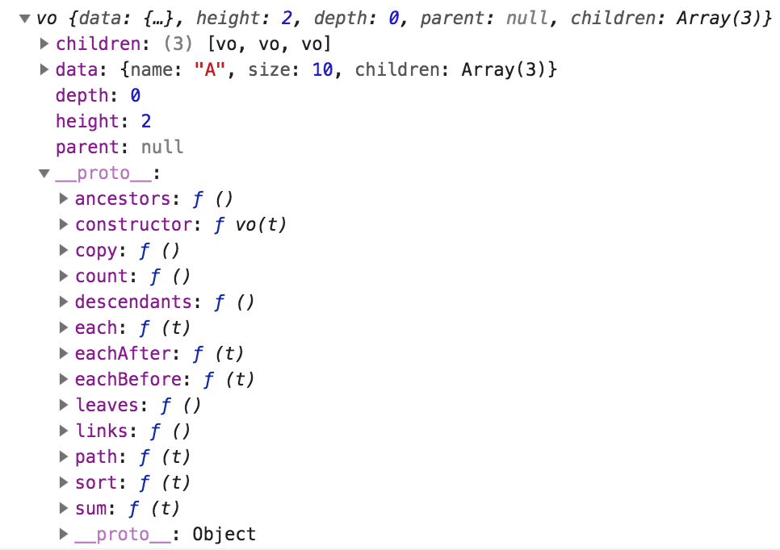

{{meta {docid: hierarchal_models}}}

<script src="https://d3js.org/d3.v4.min.js"></script>

# Hierarchal Models

D3's <a href="https://github.com/d3/d3-hierarchy">hierarchy</a> module provides methods to model hierarchal data in memory as node and link objects and to layout (compute coordinates for) the nodes.  In this chapter we discuss model construction and the properties and methods of the node object.  In subsequent chapters we discuss the layout methods that are available in the module.

## Model Construction

The  [d3.hierarchy(data[,children])](https://github.com/d3/d3-hierarchy#hierarchy) method builds a model of hierarchal data in memory. The method has two parameters, the first one is an object containing hierarchal data and the second is an optional function that takes an object as an argument and returns an array of objects.  When passed an object, the function should return an array of *child* objects for the object passed as an argument.

When the `d3.hierarchal` method is called, it considers the first argument as the *root* object and creates a node for it.  If a second function argument is passed to the method, it is called with the root object as an argument.  If the second argument is omitted, it invokes the following function:

<pre>
function children(obj) {
  return obj.children;
}
</pre>

After `d3.hierarchy` obtains the array of children for the root object, it creates nodes for each child object and then recursively calls the function argument (or default function) with each of the child objects as an argument.

Below is hierarchal data that is represented in JSON format.  The *root* object with name "A" has 3 children in an array named "children".   Within that array are 3 objects with names "B", "C", and "D".  The object with name "C" also has children with the names "E" and "F".

<pre>
  var data = {"name":"A", "size":1, "children":[
                 {"name":"B", "size":2},
                 {"name":"C", "size":3, "children":[
                     {"name":"E", "size":5},
                     {"name":"F", "size":6}]},
                 {"name":"D", "size":4}]};
</pre>

The `d3.hierarchy` method returns a node object representing the root which we can save in a variable.

<pre>
var root = d3.hierarchy(data);
</pre>

We show in the screenshot below the root node as returned by `d3.hierarchy`.



## Node Properties

Each node in the hierarchal model has the following properties.

+ node.data - the original object from the data source for which the node was created
+ node.parent - a reference to the parent node (null for the root node)
+ node.children - an array of child nodes (null for leaf nodes)
+ node.depth - the length of the path from this node up to the root
+ node.height - the greatest distance from this node to a descendant leaf node
+ node.value - optional - used by sum() and count()

## Associated Links and Related Nodes

The node object has various methods that return either an array of associated links or an array of related nodes.

+ [node.links()](https://github.com/d3/d3-hierarchy/blob/master/README.md#node_links) - returns the links to the children of this object; each link object has a source and a target field that hold references to nodes
+ [node.ancestors()](https://github.com/d3/d3-hierarchy/blob/master/README.md#node_ancestors) - returns an array of nodes from this node up to the root
+ [node.path(target_node)](https://github.com/d3/d3-hierarchy/blob/master/README.md#node_path) - returns the shortest path from this node to the target node
+ [node.descendants()](https://github.com/d3/d3-hierarchy/blob/master/README.md#node_descendants) - returns an array of all descendent nodes in topological order
+ [node.leaves()](https://github.com/d3/d3-hierarchy/blob/master/README.md#node_descendants) - returns the array of leaf nodes

## Copy

The node object also has a copy method.

+ [node.copy()](https://github.com/d3/d3-hierarchy/blob/master/README.md#node_copy) - returns a deep copy of the subtee that has a root at this *node*

## Applying a Function to Each Node in a Subtree

The `each`, `eachBefore`, and `eachAfter` methods invoke an argument function for each descendant node.

+ [node.each(function)](https://github.com/d3/d3-hierarchy/blob/master/README.md#node_each) - the subtree rooted at *node* is traversed in *breath-first search* order.  The function that is passed as an argument to `each` is invoked for each node and is passed the *node*.

In the example below we have a hierarchal object consisting of 6 nodes.  Each node has a size property.  After we construct a root node by calling `hierarchy` we call `each` on the root node which causes all of the nodes below the root node to be traversed.  When each node is traversed the number stored in the node's *size* property along with a space character is concatenated to a string.  After the subtree has been traversed, the string is displayed in a div element.

```
<script>
  var data = {"name":"A", "size":1, "children":[
                 {"name":"B", "size":2},
                 {"name":"C", "size":3, "children":[
                     {"name":"E", "size":5},
                     {"name":"F", "size":6}]},
                 {"name":"D", "size":4}]};

  var root = d3.hierarchy(data);
  var count = root.descendants().length;
  var i = 0;

  var text = "";
  root.each((d) => text += d.data.size + ((++i < count) ? ", " : " "));

  d3.select("#eachText").html(text);
</script>

<div id="eachText"></div>
```

+ [node.eachAfter(function)](https://github.com/d3/d3-hierarchy/blob/master/README.md#node_eachAfter) - the subtree rooted at *node* is traversed in *postorder traversal* order.  The function that is passed as an argument to `eachAfter` is invoked for each node and is passed the node.

+ [node.eachBefore(function)](https://github.com/d3/d3-hierarchy/blob/master/README.md#node_eachBefore) - the subtree rooted at *node* is traversed in *preorder traversal* order.  The function that is passed as an argument to `eachBefore` is invoked for each node and is passed the node.

## Setting the Value Property

The `sum` and `count` methods are used to set each descendant node's *value* property.  This property is used by some layout methods like [d3.treemap](https://github.com/d3/d3-hierarchy#treemap).

+ [node.sum(value function)](https://github.com/d3/d3-hierarchy/blob/master/README.md#node_sum) - takes a function as an argument and returns the node on which it is called.  The function argument takes an object as an argument and returns an non-negative number.

The sum method is an accumulator method.  It traverses the subtree, rooted at the node on which the method is invoked, in *postorder* traversal order.  This ensures that all child nodes are traversed before a parent node.  When a node is traversed, the function argument is called and the object in the current node's *data* property is passed to the function.  The nodes *value* property is then set to the arithmetic sum of the number returned by the value_function and the numbers in its children's *value* properties.

Stated another way, the sum method evaluates the leaf nodes first, setting their value properties to the values returned by the value function.  As the traversal moves up the subtree, each node's value property is set to the sum of the value returned by the value function and the values of the node's children's value properties.

Consider the following example.

``` {cm: visible}
<script>
root.sum((d) => d.size);

d3.select("#sumText").html("root.value: " + root.value);
</script>

<div id="sumText"></div>
```

When we call sum, we pass it a function.  The function takes as an argument the object in the node's data property and returns the number in that object's size property.

<pre>
  (d) => d.size
</pre>

When called, sum will create a new property named *value* in each node.   For each node, the value property will be set to the sum of the number returned by the value function (when called for the node) and the numbers stored in the *value* properties of the node's children.

After sum is called, we see that the root node's value property has the value 21, the sum of 1,2,3,4,5 and 6.

+ [node.count()](https://github.com/d3/d3-hierarchy/blob/master/README.md#node_count) - traverses the subtree rooted at *node* and sets each node's value property to the number of leaves in that node's subtree.

## Sorting

The `sort` method is often called prior to calling a layout method so that the children in the hierarchy are ordered before coordinates for the nodes are computed.

+ [node.sort(comparator)](https://github.com/d3/d3-hierarchy/blob/master/README.md#node_sort) - the children of each descendant are sorted based on a comparator that is passed to the method.

The comparator function takes 2 nodes as arguments and returns a negative number if the first node should be before the second node, returns a negative number if the second node should be before the first node, and returns 0 if the order doesn't matter.

The [d3 documentation](https://github.com/d3/d3-hierarchy/blob/master/README.md#node_sort) includes sort functions that can be used for circle-packing, treemaps, icicles, trees, and dendrograms.

As a final example in this chapter we reverse the order of each node's children.

```
<script>
  text = "";
  i = 0;

  root.sort((a,b) => b.data.size - a.data.size)
  .each((d) => text += d.data.size + ((++i < count) ? ", " : ""));

  d3.select("#sortText").html(text);
</script>

<div id="sortText"></div>
```

