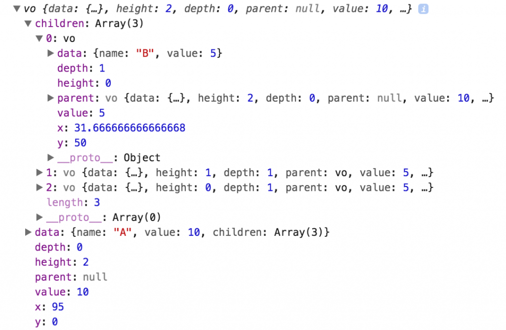

{{meta {docid: trees}}}

<script src="https://d3js.org/d3.v4.min.js"></script>


# Tree, Cluster, and Radial Layouts

A tree is a visual representation of a hierarchal model, where the nodes are (usually) represented by circles and the links are represented by lines.  A cluster layout positions each leaf node of the tree at the same level and a radial layout positions the branches of the tree about the root node.

## Tree Layout

[d3.tree()](https://github.com/d3/d3-hierarchy/blob/master/README.md#tree) is a function generator that returns a layout function that, when passed a root object of a hierarchy model, sets the x and y coordinates for each node in the hierarchy in a manner that keeps nodes that are at the same depth aligned vertically.

In order to render the tree shown below we do the following:
  * Create an JSON object that holds hierarchal data
  * Get the root of a d3.hierarchy object
  * Generate a tree layout function
  * Call the tree layout function, passing the root, to establish the x and y coordinates for the nodes
  * Render circles and lines to represent nodes and edges of the tree, respectively

```
<script>
var data = {"name": "A", "children": [
                {"name": "D"},
                {"name": "C", "children": [
                    {"name": "F"},
                    {"name": "E"}
                ]},
                {"name": "B"}
            ]};

var root = d3.hierarchy(data)
  .sort((a,b) => b.height - a.height || a.data.name.localeCompare(b.data.name));

var treeLayout = d3.tree()
  .size([580, 80]);

treeLayout(root);

// Select the SVG element
var svg = d3.select("#demo1");

// Add links
svg.select('g.links')
  .selectAll('line.link')
  .data(root.links())
  .enter()
  .append('line')
  .classed('link', true)
  .attr('x1', function(d) {return d.source.x;})
  .attr('y1', function(d) {return d.source.y;})
  .attr('x2', function(d) {return d.target.x;})
  .attr('y2', function(d) {return d.target.y;})
  .attr('stroke', "darkgray")
  .attr('stroke-width', 2);

// Add nodes
svg.select('g.nodes')
  .selectAll('circle.node')
  .data(root.descendants())
  .enter()
  .append('circle')
  .classed('node', true)
  .attr('cx', function(d) {return d.x;})
  .attr('cy', function(d) {return d.y;})
  .attr('r', 10)
  .attr("fill", "lightblue")
  .attr('stroke', "darkgray")
  .attr('stroke-width', 1);

  // draw labels
svg.select('g.labels')
  .selectAll('text.label')
  .data(root.descendants())
  .enter()
  .append('text')
  .classed('label', true)
  .style('fill', 'gray')
  .attr('x', function(d) {return d.x-5;})
  .attr('y', function(d) {return d.y+5;})
  .html((d) => d.data.name);
</script>

<svg id="demo1" width=600 height=100>
    <g transform="translate(0,10)">
      <g class="links"></g>
      <g class="nodes"></g>
      <g class="labels"></g>
    </g>
</svg>
```

## Example Explained

We start by creating an `svg` element, like the one below, to hold the visual elements.  Notice that svg element has a group element that is translated 10 pixels down.  We do this because the layout function, as we'll see later, positions the y-coordinate of the root element at 0.  When we draw nodes, we'll make their radii 10 pixels.  Since the center of the root will be at *y=0*, we translate the entire tree down by 10, so that we can see the entire root node.

<pre>
&lt;svg id="demo1" width=600 height=100&gt;
     &lt;g transform="translate(0,10)"&gt;
         &lt;g class="links"&gt;&lt;/g&gt;
         &lt;g class="nodes"&gt;&lt;/g&gt;
     &lt;/g&gt;
&lt;/svg&gt;
</pre>

We pass a hierarchal data object to `d3.hierarchy` to create the hierarchal model and to obtain a reference to the root node.  We can also sort the nodes in the tree.  Below, we sort the nodes by height, and for siblings, we sort them by name.

<pre>
var data = {"name": "A", "children": [
                {"name": "C"},
                {"name": "D", "children": [
                    {"name": "F"},
                    {"name": "E"}
                ]},
                {"name": "B"}
            ]};

var root = d3.hierarchy(data)
  .sort((a,b) => b.height - a.height || a.data.name.localeCompare(b.data.name));
</pre>

Then, we create a tree layout function by calling `d3.tree` and chain a call to [tree.size([size])](https://github.com/d3/d3-hierarchy/blob/master/README.md#tree_size), passing to `size` the dimensions of a region, that we want the tree to occupy. The layout function will then compute x and y coordinates for the nodes so that they fill the region.  In the example we specify a region 580 pixels wide and 80 pixels high.

<pre>
var treeLayout = d3.tree()
    .size([580, 80]);
</pre>

Next, we *call* the layout function, passing it the root node.  The layout function adds `x` and `y` properties to each node in the model.

<pre>
treeLayout(root);
</pre>

We can see the `x` and `y` properties when inspecting the root object, as shown in the screenshot below.



After updating the model with position information (x and y properties), we use the position information to render the lines, one for each link, and the circles, one for each node.

To render the lines we join the link objects returned by `root.links` to an empty selection.  Each link has source.x, source.y, target.x, and target.y properties.  Then in the entry selection, we append a line element to the svg for each link.

To render the circles we join the data returned by `root.descendants` to an empty selection.  In the entry selection, we append a circle element for each of the descendant nodes.  Since the layout function added x and y properties to each node we can use them to position each circle elements.

<pre>
var svg = d3.select("#demo1");

svg.select('g.links')
    .selectAll('line.link')
    .data(root.links())
    .enter()
    .append('line')
    .attr('x1', function(d) {return d.source.x;})
    .attr('y1', function(d) {return d.source.y;})
    .attr('x2', function(d) {return d.target.x;})
    .attr('y2', function(d) {return d.target.y;})
    .attr('stroke', "darkgray")
    .attr('stroke-width', 2);

svg.select('g.nodes')
    .selectAll('circle.node')
    .data(root.descendants())
    .enter()
    .append('circle')
    .attr('cx', function(d) {return d.x;})
    .attr('cy', function(d) {return d.y;})
    .attr('r', 10)
    .attr("fill", "lightblue")
    .attr('stroke', "darkgray")
    .attr('stroke-width', 1);
</pre>

## Tree Layout Function Methods

The `d3.tree` tree layout function generator has three methods that can be called to initialize the layout function.  These methods are:

* [tree.size([size])](https://github.com/d3/d3-hierarchy/blob/master/README.md#tree_size) - specifies the size of the region that the entire tree should fill.
* [tree.nodeSize([size])](https://github.com/d3/d3-hierarchy/blob/master/README.md#tree_nodeSize) - specifies the size of the non-overlapping space that should be reserved for each node.
* [tree.separation([separation])](https://github.com/d3/d3-hierarchy/blob/master/README.md#tree_separation) - specifies a function that is used to determine the desired separation between two nodes placed adjacent to one another.

### tree.size

The example shown above uses `tree.size([width, height])` to specify the overall width and height of the tree.

### tree.nodeSize

The `tree.nodeSize([width, height])` method is used in lieu of `tree.size` and takes as an argument a pair of values that represent the width and height of non-overlapping rectangular spaces that are reserved for each node.  The method returns a tree layout function.

`
var treeLayout = d3.tree().nodeSize([20, 40]);
`

When called, the tree layout function sets the root node at (0,0) and uses these rectangular boundaries (in pink) to establish where to set the x and y coordinates for each node.


```
<script>
var data = {"name": "A", "size": 15, "children": [
                {"name": "B", "size": 10},
                {"name": "C", "size": 10, "children": [
                    {"name": "E", "size": 5},
                    {"name": "F", "size": 5}
                ]},
                {"name": "D", "size": 10}
            ]};

var root = d3.hierarchy(data)
    .sort((a,b) => b.height - a.height || a.data.name.localeCompare(b.data.name));

var width = 30;
var height = 60;

var treeLayout2 = d3.tree()
   .nodeSize([width, height]);

treeLayout2(root);

// Select the SVG element
var svg2 = d3.select("#demo2");

// Rectangles
svg2.select('g.rects')
  .selectAll('rect.node')
  .data(root.descendants())
  .enter()
  .append('rect')
  .classed("rects", true)
  .attr('x', function(d) {return d.x - (width/2);})
  .attr('y', function(d) {return d.y - (height/2);})
  .attr('width', width)
  .attr('height', height)
  .attr("fill", "pink")
  .attr('stroke', "darkgray")
  .attr('stroke-width', 1);

// Links
svg2.select('g.links')
  .selectAll('line.link')
  .data(root.links())
  .enter()
  .append('line')
  .classed('link', true)
  .attr('x1', function(d) {return d.source.x;})
  .attr('y1', function(d) {return d.source.y;})
  .attr('x2', function(d) {return d.target.x;})
  .attr('y2', function(d) {return d.target.y;})
  .attr('stroke', "darkgray")
  .attr('stroke-width', 2)
  .attr('z-index', 2);

svg2.select('g.nodes')
  .selectAll('circle.node')
  .data(root.descendants())
  .enter()
  .append('circle')
  .classed('node', true)
  .attr('cx', function(d) {return d.x;})
  .attr('cy', function(d) {return d.y;})
  .attr('r', 10)
  .attr("fill", "lightblue")
  .attr('stroke', "darkgray")
  .attr('stroke-width', 1);
</script>

<svg id="demo2" width=580 height=200>
    <g transform="translate(290,30)">
      <g class="rects"></g>
      <g class="links"></g>
      <g class="nodes"></g>
    </g>
</svg>
```

### tree.separation

The `tree.separation` method is intended to be used with `tree.nodeSize`.  The method takes a function as an argument and returns a tree layout function.  The function argument must take two nodes as arguments and return a number.  The nodes are positioned so that the spacing between the two nodes is equal to the number returned by the function multiplied by the width of the bounding box specified in the call to `nodeSize`.  *Note:* the computed width is the spacing between the node positions and not the spacing between the node bounding boxes.

```
<script>
var data = {"name": "A", "children": [
                {"name": "B"},
                {"name": "C", "children": [
                    {"name": "E"},
                    {"name": "F"}
                ]},
                {"name": "D"}
            ]};

var root = d3.hierarchy(data)
  .sort((a,b) => b.height - a.height || a.data.name.localeCompare(b.data.name));

var width = 30;
var height = 60;

var treeLayout3 = d3.tree()
  .nodeSize([width, height])
  .separation((a,b) => a.depth);

treeLayout3(root);

var svg3 = d3.select("#demo3");

// Rectangles
svg3.select('g.rects')
  .selectAll('rect.boxes')
  .data(root.descendants())
  .enter()
  .append('rect')
  .classed("rects", true)
  .attr('x', function(d) {return d.x - (width/2);})
  .attr('y', function(d) {return d.y - (height/2);})
  .attr('width', width)
  .attr('height', height)
  .attr("fill", "pink")
  .attr('stroke', "darkgray")
  .attr('stroke-width', 1);

// draw links
svg3.select('g.links')
  .selectAll('line.link')
  .data(root.links())
  .enter()
  .append('line')
  .classed('link', true)
  .attr('x1', function(d) {return d.source.x;})
  .attr('y1', function(d) {return d.source.y;})
  .attr('x2', function(d) {return d.target.x;})
  .attr('y2', function(d) {return d.target.y;})
  .attr('stroke', "darkgray")
  .attr('stroke-width', 2);

// draw nodes
svg3.select('g.nodes')
  .selectAll('circle.node')
  .data(root.descendants())
  .enter()
  .append('circle')
  .classed('node', true)
  .attr('cx', function(d) {return d.x;})
  .attr('cy', function(d) {return d.y;})
  .attr('r', 10)
  .attr("fill", "lightblue")
  .attr('stroke', "darkgray")
  .attr('stroke-width', 1);

// draw labels
svg3.select('g.labels')
  .selectAll('text.label')
  .data(root.descendants())
  .enter()
  .append('text')
  .classed('label', true)
  .style('fill', 'gray')
  .attr('x', function(d) {return d.x-5;})
  .attr('y', function(d) {return d.y+5;})
  .html((d) => d.data.name);
</script>

<svg id="demo3" width=580 height=200>
    <g transform="translate(290,30)">
      <g class="rects"></g>
      <g class="links"></g>
      <g class="nodes"></g>
      <g class="labels"></g>
    </g>
</svg>
```

In the example above the separator function is

<pre>
(a,b) => a.depth
</pre>

It is invoked 3 times (with nodes B and C,  with nodes C and D, and with nodes E and F).  Recalling the hierarchal data, each of the pairs of nodes that are passed into the lambda expression are siblings and nodes B, C, and D have a depth of 1, and nodes E and F have a depth of 2.  When the lambda expression is called with B and C, since B's depth is 1, the lambda expression returns 1 creating a separation of 1 * 30 = 30 pixels between B and C.  The same happens when C and D are passed to the lambda expression.  When the lambda expression is called with E and F, since E has a depth of 2, the separation between E and F is 2 * 30 = 60 pixels.

## Cluster Layout

The [d3.cluster](https://github.com/d3/d3-hierarchy#cluster) layout positions the nodes so that the leaf nodes are positioned at the same y position.

In the example below, like our first tree example above, we chain a call to `size` after the call to `d3.cluster` to specify the desired size of the entire tree.

```
<script>
var data = {"name": "A", "children": [
                {"name": "B"},
                {"name": "C", "children": [
                    {"name": "E"},
                    {"name": "F"}
                ]},
                {"name": "D"}
            ]};

var root = d3.hierarchy(data)
  .sort((a,b) => b.height - a.height || a.data.name.localeCompare(b.data.name));

var width = 30;
var height = 60;

var treeLayout4 = d3.cluster().size([580, 80])

treeLayout4(root);

var svg4 = d3.select("#demo4");

// draw links
svg4.select('g.links')
  .selectAll('line.link')
  .data(root.links())
  .enter()
  .append('line')
  .classed('link', true)
  .attr('x1', function(d) {return d.source.x;})
  .attr('y1', function(d) {return d.source.y;})
  .attr('x2', function(d) {return d.target.x;})
  .attr('y2', function(d) {return d.target.y;})
  .attr('stroke', "darkgray")
  .attr('stroke-width', 2);

// draw nodes
svg4.select('g.nodes')
  .selectAll('circle.node')
  .data(root.descendants())
  .enter()
  .append('circle')
  .classed('node', true)
  .attr('cx', function(d) {return d.x;})
  .attr('cy', function(d) {return d.y;})
  .attr('r', 10)
  .attr("fill", "lightblue")
  .attr('stroke', "darkgray")
  .attr('stroke-width', 1);

</script>

<svg id="demo4" width=580 height=200>
    <g transform="translate(0,60)">
      <g class="links"></g>
      <g class="nodes"></g>
    </g>
</svg>

```

Just like with the tree layout, we can specify the size of bounding boxes for the nodes rather than specifying the dimenions of the overall dendrogram.

```
<script>
var data = {"name": "A", "children": [
                {"name": "B"},
                {"name": "C", "children": [
                    {"name": "E"},
                    {"name": "F"}
                ]},
                {"name": "D"}
            ]};

var root = d3.hierarchy(data)
  .sort((a,b) => b.height - a.height || a.data.name.localeCompare(b.data.name));

var width = 30;
var height = 60;

var treeLayout4 = d3.cluster()
  .nodeSize([width, height]);

treeLayout4(root);

var svg5 = d3.select("#demo5");

// Rectangles
svg5.select('g.rects')
  .selectAll('rect.boxes')
  .data(root.descendants())
  .enter()
  .append('rect')
  .classed("rects", true)
  .attr('x', function(d) {return d.x - (width/2);})
  .attr('y', function(d) {return d.y - (height/2);})
  .attr('width', width)
  .attr('height', height)
  .attr("fill", "pink")
  .attr('stroke', "darkgray")
  .attr('stroke-width', 1);

// draw links
svg5.select('g.links')
  .selectAll('line.link')
  .data(root.links())
  .enter()
  .append('line')
  .classed('link', true)
  .attr('x1', function(d) {return d.source.x;})
  .attr('y1', function(d) {return d.source.y;})
  .attr('x2', function(d) {return d.target.x;})
  .attr('y2', function(d) {return d.target.y;})
  .attr('stroke', "darkgray")
  .attr('stroke-width', 2);

// draw nodes
svg5.select('g.nodes')
  .selectAll('circle.node')
  .data(root.descendants())
  .enter()
  .append('circle')
  .classed('node', true)
  .attr('cx', function(d) {return d.x;})
  .attr('cy', function(d) {return d.y;})
  .attr('r', 10)
  .attr("fill", "lightblue")
  .attr('stroke', "darkgray")
  .attr('stroke-width', 1);

</script>

<svg id="demo5" width=580 height=200>
    <g transform="translate(290,30)">
      <g class="rects"></g>
      <g class="links"></g>
      <g class="nodes"></g>
    </g>
</svg>

```

The cluster layout also has a `separation` method that allows us to specify a separation factor that is used to compute the spacing between adjacent nodes.  When used with the cluster layout, the method passed to separation can be called on nodes that are not necessarily siblings in the hierarchal model.

```
<script>
var data = {"name": "A", "children": [
                {"name": "B"},
                {"name": "C", "children": [
                    {"name": "E"},
                    {"name": "F"}
                ]},
                {"name": "D"}
            ]};

var root = d3.hierarchy(data)
  .sort((a,b) => b.height - a.height || a.data.name.localeCompare(b.data.name));

var width = 30;
var height = 60;

var treeLayout4 = d3.cluster()
  .nodeSize([width, height])
  .separation((a,b) => (a.depth > b.depth) ? a.depth : b.depth);

treeLayout4(root);

var svg6 = d3.select("#demo6");

// Rectangles
svg6.select('g.rects')
  .selectAll('rect.boxes')
  .data(root.descendants())
  .enter()
  .append('rect')
  .classed("rects", true)
  .attr('x', function(d) {return d.x - (width/2);})
  .attr('y', function(d) {return d.y - (height/2);})
  .attr('width', width)
  .attr('height', height)
  .attr("fill", "pink")
  .attr('stroke', "darkgray")
  .attr('stroke-width', 1);

// draw links
svg6.select('g.links')
  .selectAll('line.link')
  .data(root.links())
  .enter()
  .append('line')
  .classed('link', true)
  .attr('x1', function(d) {return d.source.x;})
  .attr('y1', function(d) {return d.source.y;})
  .attr('x2', function(d) {return d.target.x;})
  .attr('y2', function(d) {return d.target.y;})
  .attr('stroke', "darkgray")
  .attr('stroke-width', 2);

// draw nodes
svg6.select('g.nodes')
  .selectAll('circle.node')
  .data(root.descendants())
  .enter()
  .append('circle')
  .classed('node', true)
  .attr('cx', function(d) {return d.x;})
  .attr('cy', function(d) {return d.y;})
  .attr('r', 10)
  .attr("fill", "lightblue")
  .attr('stroke', "darkgray")
  .attr('stroke-width', 1);

</script>

<svg id="demo6" width=580 height=200>
    <g transform="translate(290,30)">
      <g class="rects"></g>
      <g class="links"></g>
      <g class="nodes"></g>
    </g>
</svg>

```

In the example above we pass the following lambda express to `separation`.

<pre>
(a,b) => (a.depth > b.depth) ? a.depth : b.depth
</pre>

This ensures that the spacing between all of the leaves are the same.

## Radial Layouts

We can also use the tree and cluster layouts to render a radial tree as shown below.

```
<script>
var data = {"name": "A", "children": [
                {"name": "B"},
                {"name": "C", "children": [
                    {"name": "E"},
                    {"name": "F"}
                ]},
                {"name": "D"},
                {"name": "G"},
                {"name": "H", "children": [
                    {"name": "I"},
                    {"name": "J"}
                ]},
                {"name": "K"},
                {"name": "L"},
                {"name": "M", "children": [
                  {"name": "M"},
                  {"name": "N"}
                ]},
                {"name": "O"}
            ]};

var root = d3.hierarchy(data)
  .sort((a,b) => b.height - a.height || a.data.name.localeCompare(b.data.name));

var radius = 100;

var treeLayout = d3.cluster()
    .size([360, radius]);

treeLayout(root);

var svg7 = d3.select("#demo7");

// draw nodes
svg7.select('g.nodes')
  .selectAll('circle.node')
  .data(root.descendants())
  .enter()
  .append('circle')
  .classed('node', true)
  .attr('cx', 0)
  .attr('cy', d => -d.y)
  .attr('r', 5)
  .attr("fill", "lightblue")
  .attr('stroke', "darkgray")
  .attr('stroke-width', 1)
  .attr("transform", d => `
      rotate(${d.x}, 0, 0)
  `);

var lineGen = d3.lineRadial()
  .angle(d => d.x * Math.PI / 180)
  .radius(d => d.y);

var linkGen =  d3.linkRadial()
  .angle(d => d.x * Math.PI / 180)
  .radius(d => d.y);

// draw links
svg7.select('g.links')
  .selectAll('path.link')
  .data(root.links())
  .enter()
  .append("path")
  .classed('link', true)
  .attr('stroke', "darkgray")
  .attr('stroke-width', 2)
  //.attr("d", linkGen);
  .attr("d", (d) => lineGen([d.target, d.source]));

</script>

<svg id="demo7" width=580 height=250>
    <g transform="translate(290,125)">
      <g class="rects"></g>
      <g class="links"></g>
      <g class="nodes"></g>
    </g>
</svg>

```

To create this example we used the cluster layout so that all of the leaves were at the same depth.  We called `cluster.size`, passing to it `[360,radius]`.  When the layout function is called with the hierarchal data, it positions the nodes as if in a cluster tree, not in a radial layout.  When we position our circles and lines we'll need to interpret the (x,y) coordinates that the cluster layout generated as angle and radii values.  Since the x values are between 0 and 360 we can use them as angle values and since the y values are between 0 and radius, we can use them as radii values.

<pre>
var treeLayout = d3.cluster()
    .size([360, radius]);
</pre>

After calling the layout function we create circles for each node and initially position each circle at `(0,-y)` where `y` is the y-coordinate that the layout function computed for the node.  Recall that this value will be between 0 and `radius`.  This will place all of the circles on the y-axis above the origin (at 0 degrees) and at the appropriate distance from the origin.

<pre>
  .append('circle')
  .attr('cx', 0)
  .attr('cy', d => -d.y)
</pre>

We then rotate each circle about the origin so that it's angle is equal to the x-coordinate computed by the layout function, a value between 0 and 360 degrees.

<pre>
  .attr("transform", d => `rotate(${d.x}, 0, 0)`);
</pre>

For the links we create a lineRadial line generator and set its angle and radius functions.  Since the angle function has to return a value in radians we convert degrees to radians.

<pre>
var lineGen = d3.lineRadial()
  .angle(d => d.x * Math.PI / 180)
  .radius(d => d.y);
</pre>

To get the string for the path's `d` attribute we call the line generator and pass to it an array containing the source and target nodes.

<pre>
  .attr("d", (d) => lineGen([d.source, d.target]));
</pre>